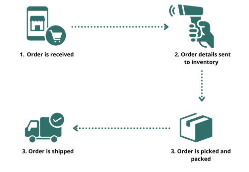

# Ordering System

The purpose of this repository is for the requirement of **Application Development and Emerging Technologies** 
in which we are tasked to **__create a new repository and create a proper README.md file__**

# Table of Contents

* ## [Organization](https://github.com/Akikiii/-itelective3-web/edit/main/README.md#the-local-government-unit-of-caraga)
* ## [Frameworks](https://github.com/Akikiii/-itelective3-web/edit/main/README.md#frameworks-used)
   - [WordPress](https://github.com/Akikiii/-itelective3-web/edit/main/README.md#wordpress)
   - [WooCommerce](https://github.com/Akikiii/-itelective3-web/edit/main/README.md#woocommerce)
* ## [System](https://github.com/Akikiii/-itelective3-web/edit/main/README.md#order-system)

### The Local Government Unit of Caraga

[Click here to see more about the Chosen Organization](https://cmci.dti.gov.ph/lgu-profile.php?lgu=Caraga)

### Frameworks used

#### WordPress

> __You may host and create websites using the content management system (CMS) known as WordPress. WordPress has a template system and a plugin architecture that allow you to personalize any website to meet your company, blog, portfolio, or online store.__

[Visit their website by clicking here](https://wordpress.com/)

#### WooCommerce

> __WooCommerce is a plugin that connects seamlessly with your current WordPress website, transforming it into a fully working WordPress e-commerce website in just a few simple steps. Basically, this free WordPress plugin gives your WordPress website e-commerce capabilities so you may open an online store. A fully working e-commerce website may be created from your WordPress website with only a few clicks.__

[Visit their website by clicking here](https://woocommerce.com/)

###  Order System

###### The "mechanical" aspect of inventory management is ordering systems. These are the software applications that convert our projections, actual orders, safety stock, and order amounts into purchase orders or production orders. 

[1]: https://cmci.dti.gov.ph/lgu-profile.php?lgu=Caraga
